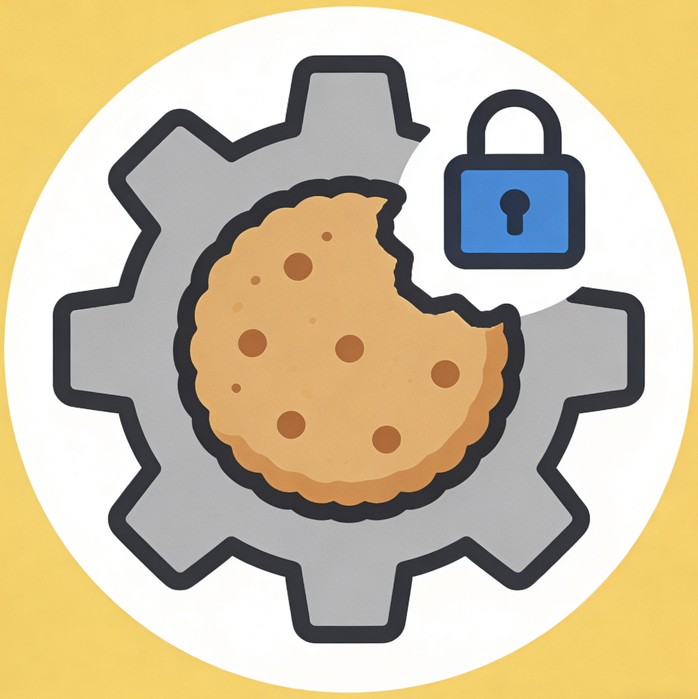

# 🍪 LXCookie Manager

  

  <h3 align="center">
    <strong>高级 Cookie 管理扩展</strong>
  </h3>
  

    智能白名单/黑名单管理，精准控制 Cookie 生命周期 
    智能风险识别，保护隐私安全 
    基于 WXT 框架构建，完美兼容 Chrome/Edge 浏览器
  

  

    
    
    
    
    
  

---

## ✨ 核心功能

### 🛡️ 双模式智能管理

|      模式      | 说明                                    | 适用场景             |
| :------------: | --------------------------------------- | -------------------- |
| **白名单模式** | 仅白名单内网站保留 Cookie，其他自动清理 | 保护常用网站登录状态 |
| **黑名单模式** | 仅黑名单内网站清理 Cookie，其他保留     | 针对性清理特定网站   |

### 🔍 智能风险识别

基于权威数据源的 Cookie 风险评估系统：

| 数据源 | 域名数量 | 说明 |
|:------:|:--------:|------|
| **EasyPrivacy** | ~47,000 | 专注于网络追踪、遥测、分析器 |
| **Peter Lowe's** | ~3,500 | 经典广告服务器和追踪服务器列表 |
| **合并去重** | ~50,700 | 总计唯一追踪域名 |

风险评分系统

| 风险等级 | 评分范围 | 说明 |
|:--------:|:--------:|------|
| 🔴 **极高风险** | 60-100 | 多个高风险因素叠加 |
| 🟠 **高风险** | 40-59 | 追踪 Cookie 或敏感 Cookie |
| 🟡 **中风险** | 20-39 | 存在安全属性问题 |
| 🟢 **低风险** | 0-19 | 安全状态良好 |

风险因素检测

| 因素 | 分数 | 说明 |
|:-----|:----:|------|
| 追踪 Cookie | +40 | 域名/名称匹配追踪列表 |
| 敏感 Cookie | +25 | 包含 session/auth/token 等关键词 |
| 第三方 Cookie | +15 | 域名与当前页面不匹配 |
| 非 HttpOnly | +12 | 可被 JavaScript 访问 |
| 非 Secure | +10 | 可能通过 HTTP 传输 |
| SameSite=None | +8 | 允许跨站发送 |
| 长期有效 | +8 | 有效期超过 90 天 |
| 会话 Cookie | -5 | 浏览器关闭即失效（降低风险） |

### 🍪 Cookie 精准控制

- **实时统计**：总数、当前网站、会话 Cookie、持久 Cookie 一目了然
- **详细信息**：查看 Cookie 名称、值、域名、路径、过期时间、安全属性
- **风险展示**：显示风险等级、评分、具体风险因素
- **Cookie 编辑**：支持创建、编辑、删除单个 Cookie
- **选择性清理**：全部 Cookie / 仅会话 Cookie / 仅持久 Cookie
- **过期清理**：一键清理所有已过期的 Cookie

### 🤖 自动化清理

- **标签页丢弃**：当标签页被丢弃时自动清理对应 Cookie
- **启动清理**：浏览器启动时自动清理当前标签页 Cookie
- **过期检测**：自动识别并清理过期 Cookie

### 📊 数据自动更新

追踪域名数据通过 CI/CD 自动更新：

| 触发条件 | 更新模式 |
|:---------|:---------|
| 本地开发 | 允许失败模式 |
| PR 构建 | 允许失败模式 |
| 主分支推送 | 严格模式 + 新鲜度检查 |
| 正式发布 | 严格模式 + 新鲜度强制 |

### 🎨 个性化体验

- **四种主题支持**：跟随系统 / 亮色模式 / 暗色模式 / 自定义主题
- **自定义颜色**：主色调、成功色、警告色、危险色、背景色、文字色完全可定制
- **清理日志**：完整记录清理历史，支持按时间筛选
- **操作反馈**：即时消息提示，操作结果清晰可见

---

## 🛠️ 技术栈

|           技术            |  版本   | 说明               |
| :-----------------------: | :-----: | ------------------ |
|          **WXT**          | 0.20.20 | 现代浏览器扩展框架 |
|         **React**         | 19.2.4  | 前端 UI 框架       |
|      **TypeScript**       |  5.9.3  | 类型安全开发       |
| **@wxt-dev/module-react** |  1.2.2  | WXT React 模块     |
|        **Manifest**        |   V3    | Chrome 扩展规范    |
|         **pnpm**          | 10.33.0 | 包管理器           |

---

## 🔒 权限说明

### 必需权限

|      权限      | 用途                    |
| :------------: | ----------------------- |
|   `cookies`    | 读取和管理浏览器 Cookie |
|   `storage`    | 存储设置和名单数据      |
|     `tabs`     | 获取当前标签页信息      |
| `browsingData` | 清理浏览器缓存数据      |
|    `alarms`    | 定时任务调度            |

### 主机权限

|     权限      | 用途                     |
| :-----------: | ------------------------ |
| `https://*/*` | 管理 HTTPS 网站的 Cookie |
| `http://*/*`  | 管理 HTTP 网站的 Cookie  |

---

## ⚠️ 隐私声明

- 🔒 所有数据处理均在本地完成
- 🚫 不会收集或上传任何用户数据
- ✅ 严格遵循隐私优先原则
- 📊 追踪域名数据来自权威开源项目（EasyPrivacy、Peter Lowe's）

---

## 📄 许可证

本项目采用 [MIT License](https://github.com/LX-Addons/LXCookie_Manager/blob/main/LICENSE) 开源。

---

  

    <strong>Made with ❤️ for privacy-conscious users</strong>
  

  

    Copyright © 2026 LXCookie Manager. All rights reserved.
  

